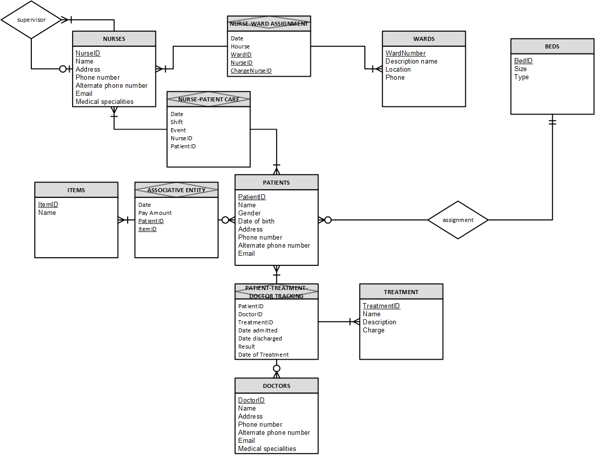

# Hospital Database Design and Administration Project

## Introduction
Each day, a myriad of activities and interactions occurs among patients, nurses, and doctors within a hospital. Managing and organizing this extensive array of functions poses a big challenge for manually hospital administrators. To streamline operations, a database should established to track nurse assignments, patients' admissions facilitated by doctors, bed assignments, and more. This project is aiming to design and administering a database utilizing SQL Server Management Studio.  

## Objectives
I do the project with two main goals:  
* Based on the requirements from the hospital, build a database that effectively and efficiently record all the required information and enable to generate reports.
* Extract and transform data to create reports.
## Database Design and Implementation
In this stage, I identified the entities for data tracking, constructed the relationship diagram using Visio, and established the database to store data on SQL Server.  

[Narrative](https://github.com/thucnhii/hospital-database-project/blob/c5800d1dafb529e6eb9593a07a57faf3bb38b390/HOSPITAL%20Administrator%20-%20Narrative.pdf)  
  
[Relation Schema](https://github.com/thucnhii/hospital-database-project/blob/d0e43fb73de73a422fbb18cbf068377e74640e4a/Hospital%20Relation%20Schema.pdf)  
[Data Dictionary](https://github.com/thucnhii/hospital-database-project/blob/a7ad7ac56c8b23f28ac28e84b3ae289cd205515e/Data%20Dictionary%20-%20Hospital%20-%20Wallace2.pdf)  
Data Set: This is a fabricated collection of data that I created for the purpose of building the demo.

# Data Extraction and Querying
I used SQL Server operators to develop triggers for data protection and crafted queries for data extraction and transformation, ultimately producing reports in a humanreadable format.  

[Create Triggers](https://github.com/thucnhii/hospital-database-project/blob/be1cf32d9dd1ce5e55c34cb11a3a13913300d90f/Trigger.sql)  
[Query for Reporting](https://github.com/thucnhii/hospital-database-project/blob/be1cf32d9dd1ce5e55c34cb11a3a13913300d90f/Report.sql)
