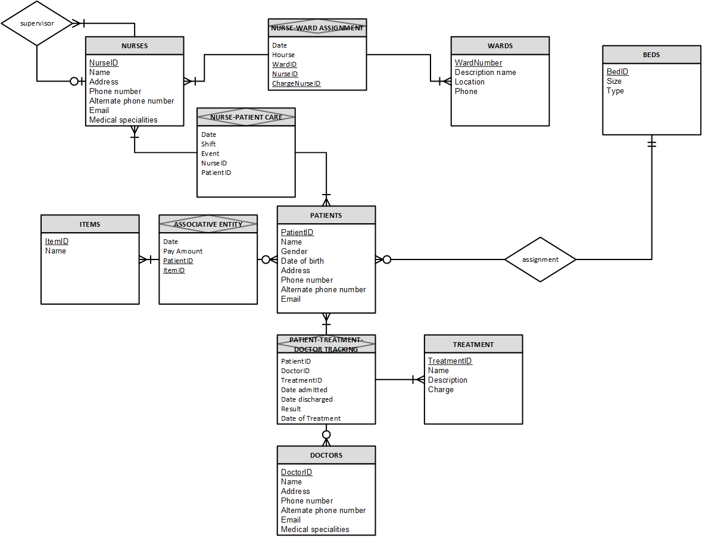

# Hospital Database Design and Administration Project

## Introduction
Each day, a myriad of activities and interactions occurs among patients, nurses, and doctors within a hospital. Managing and organizing this extensive array of functions poses a big challenge for manually hospital administrators. To streamline operations, a database should established to track nurse assignments, patients' admissions facilitated by doctors, bed assignments, and more. This project is aiming to design and administering a database utilizing SQL Server Management Studio.  

## Objectives
I do the project with two main goals:  
* Based on the requirements from the hospital, build a database that effectively and efficiently record all the required information and enable to generate reports.
* Extract and transform data to create reports.
## Database Design and Implementation
Firstly, I read the [requirements](https://github.com/thucnhii/hospital-database-project/blob/c5800d1dafb529e6eb9593a07a57faf3bb38b390/HOSPITAL%20Administrator%20-%20Narrative.pdf) and build the Entity Relation Diagram to visualize the relationships among all entities that enable me to create tables and elements to comprehensively tracking the hospital.  
*This is the Entity Relation Diagram*  
  

Consequently, I built the [Relation Schema](https://github.com/thucnhii/hospital-database-project/blob/d0e43fb73de73a422fbb18cbf068377e74640e4a/Hospital%20Relation%20Schema.pdf) and 
[Data Dictionary](https://github.com/thucnhii/hospital-database-project/blob/a7ad7ac56c8b23f28ac28e84b3ae289cd205515e/Data%20Dictionary%20-%20Hospital%20-%20Wallace2.pdf) to define the structure and organization of the relational database in the tabular form and give more detailed information about the data within the database.  

## Data Extraction and Querying
After building the database in SQL, I wrote [insert queries](InsertQueries.sql) with the purpose of testing the table relations and building data for reporting. 

*The data is fabricated because its purpose is only for testing the relational database.* 

I also extracted and transformed data to generate the [report](https://github.com/thucnhii/hospital-database-project/blob/be1cf32d9dd1ce5e55c34cb11a3a13913300d90f/Report.sql) for the hospital, with these questions:  
* How many physicians' total admits for the specific year?
* What is the average age of patients addmitted by a Physician?
* Item bills of patients, sorted by date.
* What are treatments that a patient treated by a physician?
* What are events between nurses and patients?
* What beds that are available? or filled by which patients?
* Who are nurses not assigned to patients?
* Provide a template with nurse and ward for nurse assignment.

## Other Advanced Operations
[Create Triggers](https://github.com/thucnhii/hospital-database-project/blob/be1cf32d9dd1ce5e55c34cb11a3a13913300d90f/Trigger.sql)  
Create SPROC
